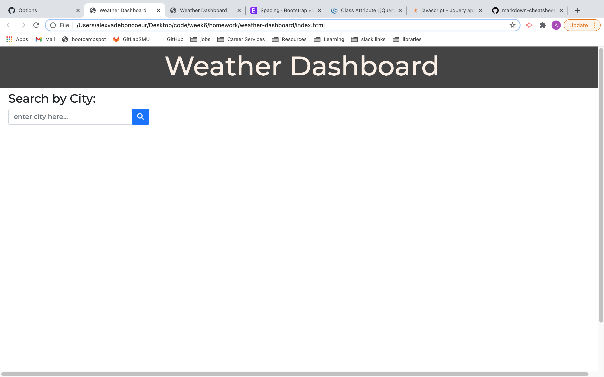
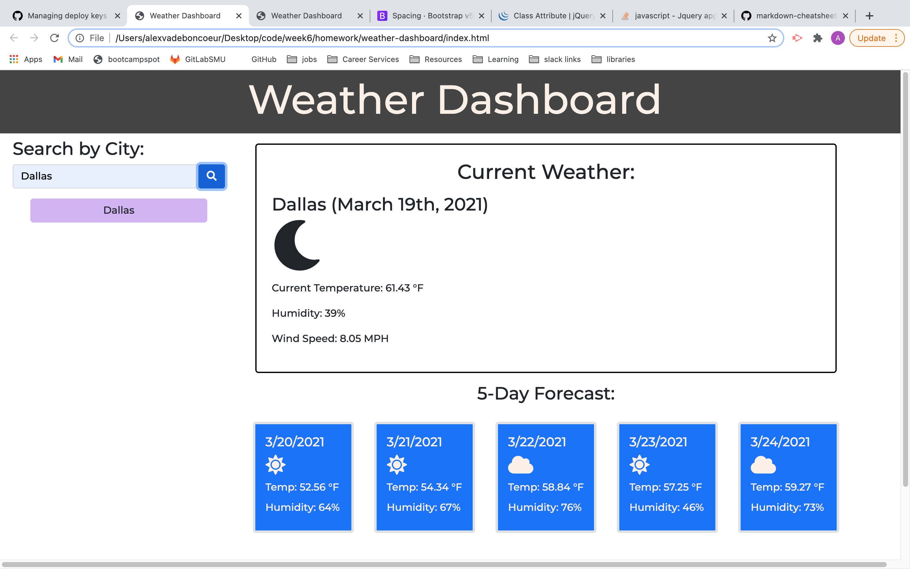
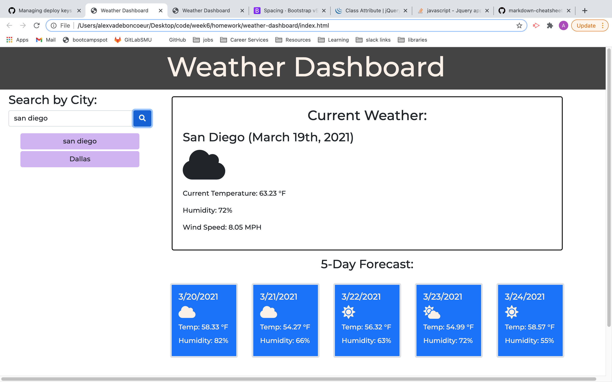
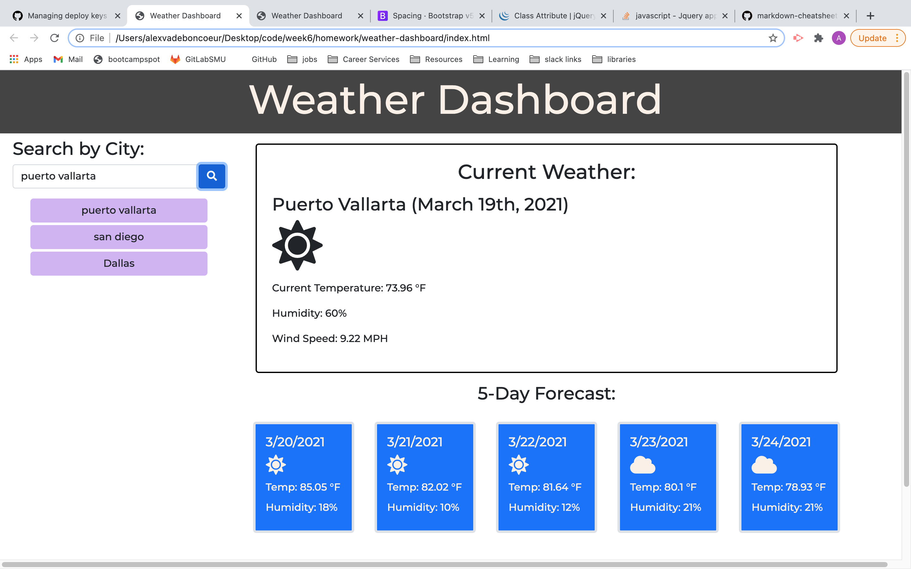
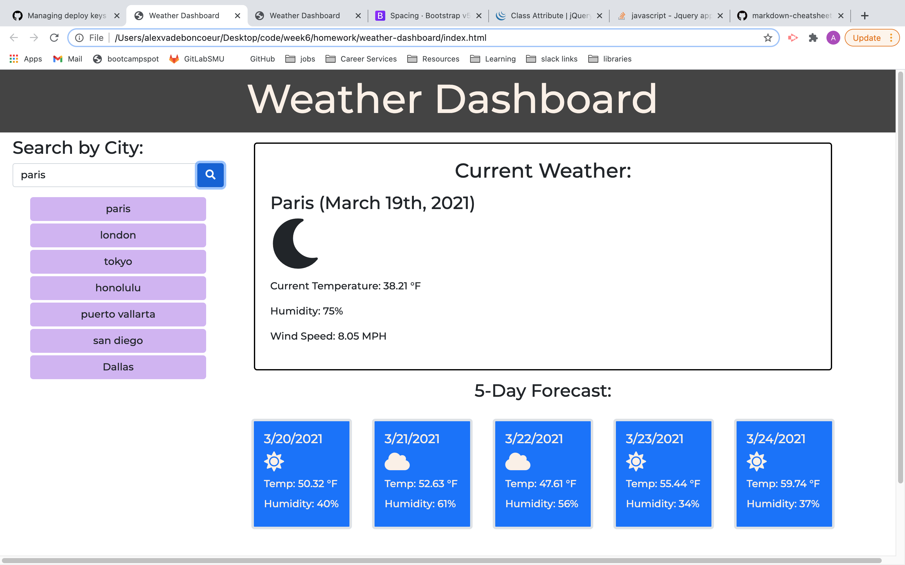
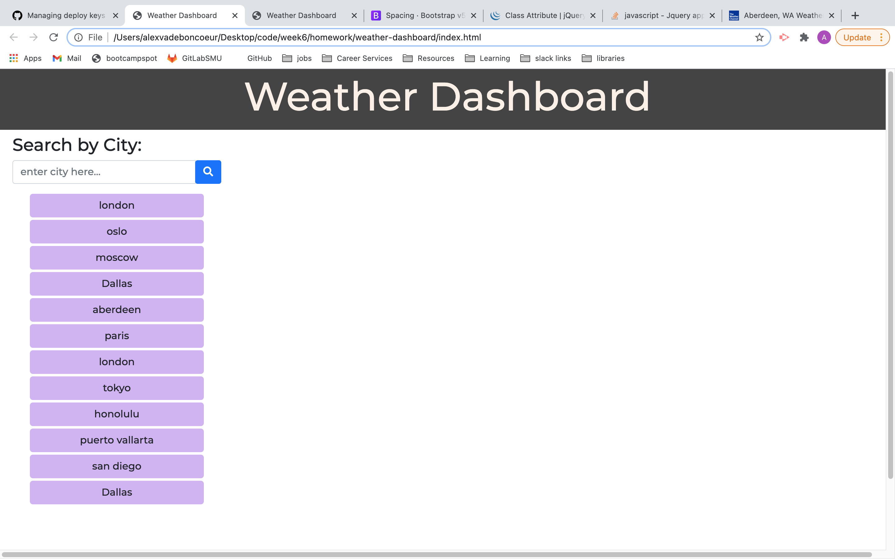

# weather-dashboard

## [Weather DashBoard Link](https://alexva397.github.io/weather-dashboard/)

The Weather Dashboard is designed to be quick and simple way to provide the user with the current weather and 5-day forecast for their requested city.

When the user clicks the search button:

- they are presented with the current weather of the searched city.
    including:
    - The city name and date.
    - A weather icon signifying the current weather.
    - Current temperature.
    - Humidity.
    - Wind speed.

- The Five Day forecast displays:
    - The Date.
    - A weather icon signifying the forecasted weather.
    - The forecasted temperature.
    - The forecasted humidity.

Each search item is saved as a button for the user to click and view the weather of past searches.

When the user reloads the page, their previous search is saved and autogenerated upon load.

The app uses custom weather icons from Font Awesome.

## Comments: 
Any commented out code is in development and will later be added to improve the functionality of the app.

- I would like to add a clear search history button that generates only when there are past searches.

- I would like to add color schemes to both current and forecast weather elements that correspond with the weather/time of day.

## Screenshots

